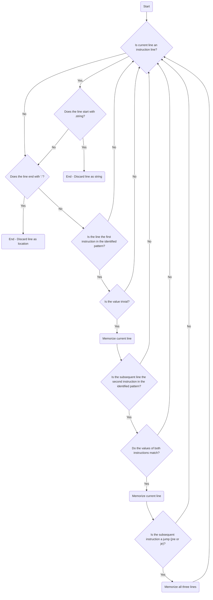

# Detecting Branch Vulnerabilities in x86 Assembly

*Branch* is a fault injection vulnerability pattern that arises from the usage of booleans for sensitive decisions [1]. `Booleans` refers to trivial numerical values such as `0` or `1`. Such values are commonly used to determine the successful, or unsuccessful, completion of an operation.

While there are methods to detect such vulnerable patterns in C source code [2], there is a lack of detection in lower levels of programming architecture. The expansion of pattern detection onto assembly removes the current limitation of needing source code in order to detect vulnerabilities. With identified assembly patterns, the only required source is a binary, or compiled, file.

## Requirements

The current vulnerability detection process requires an assembly source file as an input.

In the case of this proof-of-concept, all assembly files were generated from C source files.

### Generating Assembly Files

Generating assembly files involves compiling existing C source code, for which a C compiler is needed. All compilation for this project was done with `CC 11.3.0`.

```terminal
cc (Ubuntu 11.3.0-1ubuntu1~22.04) 11.3.0
Copyright (C) 2021 Free Software Foundation, Inc.
This is free software; see the source for copying conditions.  There is NO
warranty; not even for MERCHANTABILITY or FITNESS FOR A PARTICULAR PURPOSE.
```

The compilation of C to generate assembly is done so by calling the C compiler using the `-S` flag:

```bash
cc -S filename.c -o assembly_filename.s
```

This directs the compiler to generate assembly source (`assembly_filename.s`) from the provided C source (`filename.c`).

## Branch Pattern in x86

By comparing multiple assembly files generated from secured and insecured C sources, a clear pattern was identified:

```asm
movl $1, -4(%rbp)
cmpl $1, -4(%rbp)
jne .L2
```

The pattern represents a jump, or conditional, statement. The compiler first moves (`movl`) `1` to the top of the stack (`-4(%rbp)`), then compares `1` to the valued stored at the top of the stack (`1`). Finally, the result of this operation (`1-1`) is checked, and if the result is `0` (`jne`), then a jump is performed towards the location of `.L2`.

These instructions, occurring in a consecutive manner, showcase a clear branch vulnerability, if and only if they contain trivial numerical values, or booleans (i.e. `0` or `1`).

A secured example for this pattern would contain a non-trivial numerical value:

```asm
movl $15525, -4(%rbp)
cmpl $15525, -4(%rbp)
jne .L2
```

Non-trivial numerical values are more difficult to set by fault injection [1].

## Detection

### Parse

The detection process operates by going over all lines of the provided assembly file.

The analysis starts by detecting whether the current line is an instruction line. Instruction lines are lines that contain instructions, or opcode. While this definition may appear circular, this distinction is needed as lines could also be locations, or strings rather than instructions.

To accomplish this, the first and last character(s) of a line are examined. In the case of the first characters being `.string`, then the line would be considered as a string and discarded. On the other hand, if the line ends with a colon `:`, then the line would be considered a location. The following depicts a location and a string lines, respectively:

```asm
.LC0:
    .string "Executing critical code..."
```

Once the parser has identified all instructions, the analyzer goes through all of them line-by-line.

### Analysis

If the current line contains the first instruction in the identified pattern (`movl`), then the value and destination of such instruction are considered. If such value is identified as trivial (`0`, `-1`, `1`, `-2`, `2`), then the current line is remembered. Otherwise, the line is disregarded and the process continues until it finds the beginning of the pattern.

```asm
movl $1, -4(%rbp)
```

Following a vulnerable `movl`, if the subsequent line contains the second instruction in the identified pattern (`cmpl`) **and** their values and destinations match, meaning that the `cmpl` instruction contains the same trivial value as `movl` and the location where `movl` was pointing to, then the current line is also remembered. Otherwise, the current and previous lines are disregarded and the search for the first instruction of the pattern starts again.

```asm
cmpl $1, -4(%rbp)
```

Finally, if the subsequent instruction to `cmpl` is a jump, `jne` **or** `je`, then all three lines are remembered and a new search begins for more pattern occurrences. If the subsequent instruction is not a jump, all previous lines are disregarded and a new search for the initial instruction pattern begins.

```asm
jne .L2
```

### Analysis Flowchart



Essentially, the pattern to identify is a push of a trivial numerical value onto the stack, a comparison of such value against itself, and the presence of a jump afterwards. If such pattern occurs, then a branch vulnerability was detected.

## References

[1]: M. Witteman, "Secure application programming in the presence of side channel attacks," Riscure, Tech. Rep., Aug 2017. [Online]. Available: <https://www.riscure.com/uploads/2017/08/Riscure> Whitepaper Side Channel Patterns.pdf

[2]: L. Reichling, I. Warsame, S. Reilly, A. Brownfield, N. Niu and B. Wang, "FaultHunter: Automatically Detecting Vulnerabilities in C against Fault Injection Attacks," 2022 IEEE/ACM International Conference on Big Data Computing, Applications and Technologies (BDCAT), Vancouver, WA, USA, 2022, pp. 271-276, doi: 10.1109/BDCAT56447.2022.00045.
