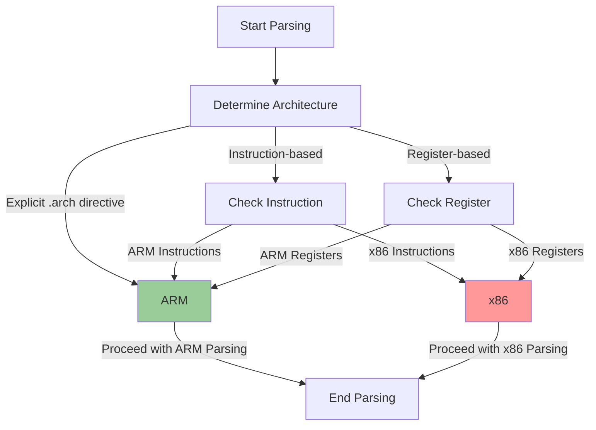
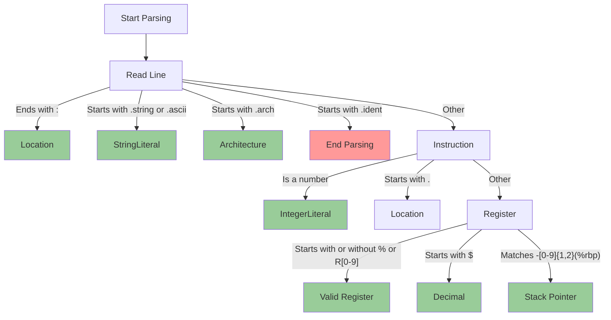

# Assembly File Parsing and Architecture Detection

## Table of Contents

- [Assembly File Parsing and Architecture Detection](#assembly-file-parsing-and-architecture-detection)
  - [Table of Contents](#table-of-contents)
  - [Introduction](#introduction)
  - [Architecture Detection](#architecture-detection)
    - [How it Works](#how-it-works)
    - [Diagram](#diagram)
  - [General Parsing](#general-parsing)
    - [How it Works](#how-it-works-1)
  - [Classes](#classes)
  - [Diagram](#diagram-1)

## Introduction

This document explains the Python code for parsing an x86 assembly file and detecting its architecture.

## Architecture Detection

The `Architecture` class is responsible for determining the architecture of the assembly code. It checks for specific instructions and register names unique to each architecture (ARM and x86).

### How it Works

1. The `determine_architecture` method checks each line of the assembly code.
2. It identifies specific instructions and register names to determine the architecture.
3. Once the architecture is determined, it sets the `is_determined` flag to `True`.

### Diagram

## General Parsing

The `Parser` class handles the general parsing of the assembly file.

### How it Works

1. Reads the assembly file line by line.
2. Identifies different sections like locations, string literals, and instructions.
3. Populates the `program` list with parsed objects.

## Classes

- `Register`: Represents a register and its properties.
- `IntegerLiteral`: Represents an integer literal.
- `StringLiteral`: Represents a string literal.
- `Location`: Represents a location in the assembly code.
- `Instruction`: Represents an instruction line.
- `Address`: Represents an address or memory location.
- `Architecture`: Responsible for determining the architecture.

## Diagram

