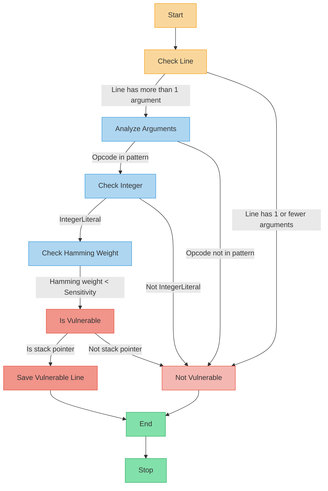

# Detecting Constant Coding Vulnerabilities in x86 Assembly

- [Detecting Constant Coding Vulnerabilities in x86 Assembly](#detecting-constant-coding-vulnerabilities-in-x86-assembly)
  - [Requirements](#requirements)
    - [Generating Assembly Files](#generating-assembly-files)
  - [ConstantCoding Pattern in x86](#constantcoding-pattern-in-x86)
  - [Detection](#detection)
  - [References](#references)

*ConstantCoding* pattern covers sensitive constants that carry a limited set of values/states, e.g., 0, 1, 0xFF, where these constant values can be easily modified from one to another within the set by modifying a single bit. [1]. In essence, by using numerical values with greater Hamming weights, the intention is to introduce more bit variations, which can help enhance security against certain types of attacks, such as fault injection.

While there are methods to detect such vulnerable patterns in C source code [2], there is a lack of detection in lower levels of programming architecture. The expansion of pattern detection onto assembly removes the current limitation of needing source code in order to detect vulnerabilities. With identified assembly patterns, the only required source is a binary, or compiled, file.

## Requirements

The current vulnerability detection process requires an assembly source file as an input.

In the case of this proof-of-concept, all assembly files were generated from C source files.

### Generating Assembly Files

Generating assembly files involves compiling existing C source code, for which a C compiler is needed. All compilation for this project was done with `CC 11.3.0`.

```terminal
cc (Ubuntu 11.3.0-1ubuntu1~22.04) 11.3.0
Copyright (C) 2021 Free Software Foundation, Inc.
This is free software; see the source for copying conditions.  There is NO
warranty; not even for MERCHANTABILITY or FITNESS FOR A PARTICULAR PURPOSE.
```

The compilation of C to generate assembly is done so by calling the C compiler using the `-S` flag:

```bash
cc -S filename.c -o assembly_filename.s
```

This directs the compiler to generate assembly source (`assembly_filename.s`) from the provided C source (`filename.c`).

## ConstantCoding Pattern in x86

It involves the presence of a constant value being moved onto the stack, which can potentially introduce vulnerabilities in the program's logic. In this case, we will focus on the following pattern:

```asm
movl #, -4(%rbp)
```

The `movl` instruction is used to move a value into a destination operand. In this pattern, the `#` represents the constant value being moved onto the stack. The `movl` instruction copies the value into the memory location specified by `-4(%rbp)`. Let's discuss the significance of the `%rbp` register.

In x86 assembly language, the `%rbp` register is the base pointer register. It points to the base (or bottom) of the current stack frame. The stack is a region of memory used for storing local variables, function parameters, and other data during the execution of a program. By referencing `%rbp` with an offset, such as `-4(%rbp)`, the instruction is accessing a specific location within the stack frame.

Now, let's consider the vulnerability detection mechanism based on the sensitivity of the constant value. The sensitivity is by the hamming weight of the found decimal value. The hamming weight refers to the number of non-zero bits in a binary representation of the value. If the hamming weight of the constant value falls below a certain sensitivity threshold, it is considered trivial and vulnerable.

To illustrate this vulnerability detection, let's provide an example in C that is equivalent to the given assembly instruction:

```c
int value = #;
```

In the C code snippet, the variable value is assigned the constant value represented by `#`. The vulnerability detection mechanism would analyze the decimal value of `#``, convert it to binary, and calculate its hamming weight. If the hamming weight is below the sensitivity threshold, it indicates a potential vulnerability.

## Detection



## References

[1]: M. Witteman, "Secure application programming in the presence of side channel attacks," Riscure, Tech. Rep., Aug 2017. [Online]. Available: <https://www.riscure.com/uploads/2017/08/Riscure> Whitepaper Side Channel Patterns.pdf

[2]: L. Reichling, I. Warsame, S. Reilly, A. Brownfield, N. Niu and B. Wang, "FaultHunter: Automatically Detecting Vulnerabilities in C against Fault Injection Attacks," 2022 IEEE/ACM International Conference on Big Data Computing, Applications and Technologies (BDCAT), Vancouver, WA, USA, 2022, pp. 271-276, doi: 10.1109/BDCAT56447.2022.00045.
