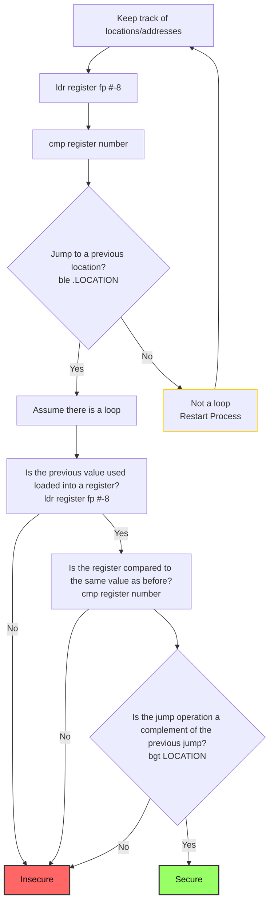

# Detecting LoopCheck Vulnerabilities in ARM Assembly

```mermaid
graph TD;
  A[Keep track of locations/addresses] --> B[ldr register fp #-8];
  B --> C[cmp register number];
  C --> D{Jump to a previous location?\nble .LOCATION};
  D -->|Yes| E[Assume there is a loop];
  D -->|No| F[Not a loop\nRestart Process] --> A;
  E --> G[Is the previous value used loaded into a register?\nldr register fp #-8];
  G -->|No| K[Insecure];
  G --> |Yes| H[Is the register compared to the same value as before?\ncmp register number];
  H -->|No| K;
  H --> I{Is the jump operation a complement of the previous jump?\nbgt LOCATION};
  I -->|Yes| J[Secure];
  I -->|No| K[Insecure];
  classDef green fill:#9f6,stroke:#333,color:#000,stroke-width:2px;
  classDef red fill:#f66,stroke:#333,color:#000,stroke-width:2px;
  classDef gold stroke:#ffcc00;
  class J green;
  class K red;
  class F gold;
```